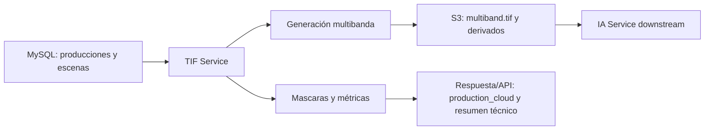
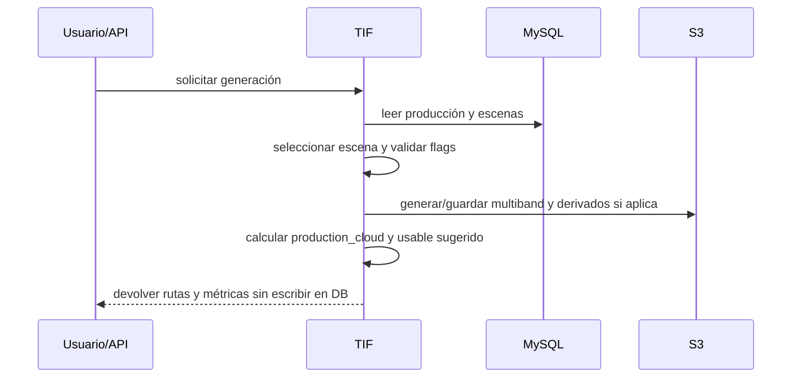

# AgroSentinel TIF Microservice

Microservicio REST para generar productos raster y derivados de monitoreo a partir de escenas ya indexadas en MySQL.

Este módulo es el encargado de preparar el dataset técnico que consume el módulo IA, pero **no ejecuta IA**.

La configuración del servicio se resuelve desde DynamoDB. El archivo `.env`
solo debe contener lo mínimo para conectarse a DynamoDB y localizar el registro
`app_config` del microservicio. El resto de variables operativas vive en ese
registro de configuración.

DynamoDB no es fuente de datos de negocio para TIF: únicamente entrega
configuración runtime. Las escenas y producciones se consultan desde MySQL, y
los insumos raster se leen desde S3. Este módulo no modifica ninguna base de
datos.

## Alcance

Este servicio:

- toma producciones y escenas desde MySQL
- construye un `multiband.tif` por escena usando `tile_bbox`
- aplica el polígono real de la produccion para calcular calidad
- calcula valores técnicos como `production_cloud` en memoria o respuesta
- genera archivos técnicos derivados cuando se solicite el proceso
- devuelve un resumen de los archivos generados o esperados
- expone endpoints para pruebas individuales, por producción y masivas
- en cargas pesadas devuelve un `job_id` y bloquea otra carga pesada hasta terminar

Este servicio **no**:

- genera recomendaciones IA
- decide estados de negocio
- reemplaza el módulo IA
- usa DynamoDB como fuente de verdad de negocio
- programa tareas recurrentes
- ejecuta workers tipo scheduler por hora/día
- altera la estructura de MySQL (`CREATE`, `ALTER`, `DROP`, `TRUNCATE`)
- inserta, actualiza o elimina registros en MySQL
- escribe en DynamoDB
- actualiza banderas como `truth_tif_exists`, `params_exists`, `production_cloud` o `usable`

## Arquitectura



## Fuentes de verdad

### Entrada

- `s3_monitoring_producciones`
- `s3_monitoring_escenas`

### Consulta

- `s3_monitoring_escena_archivos`

El servicio solo puede consultar tablas. No debe crear, alterar, insertar,
actualizar ni eliminar registros. Las migraciones o cambios de estructura
quedan fuera del microservicio.

### Salida técnica

- S3 para raster, PNG y JSON derivados, si la ruta solicitada genera archivos
- Respuesta HTTP/job para métricas, archivos generados y trazabilidad de ejecución
- MySQL queda como lectura únicamente

### IA

- `s3_monitoring_escena_ia_resumen` queda como salida del módulo IA, no como responsabilidad principal del TIF

## Flujo objetivo

### 1. Selección

El servicio consulta una producción o un conjunto de producciones desde MySQL.

### 2. Construcción del tile

Se usa `tile_bbox` de `s3_monitoring_producciones` como recorte inicial.

### 3. Generación del multiband

Se construye `multiband.tif` con las bandas requeridas.

Las bandas no siempre tienen la misma resolución espacial. En Sentinel-2 hay
bandas de 10 metros por pixel y bandas de 20 metros por pixel. Antes de crear
el `multiband.tif`, todas las bandas deben reproyectarse/alinearse al mismo
grid, CRS, transform, ancho, alto y resolución objetivo para evitar
deformaciones.

### 4. Generación de archivos

Se generan archivos técnicos en S3 o almacenamiento configurado, pero no se
indexan en MySQL desde este módulo.

### 5. C?lculo de calidad

Se usa `poligono` de `s3_monitoring_producciones` para calcular la nubosidad real dentro del ?rea productiva.

Regla actual para `production_cloud`:

- Clases SCL consideradas como nube: `3, 7, 8, 9, 10`
- Clases SCL observables: `4, 5, 6`
- Clases SCL ignoradas para el c?lculo principal: `0, 1, 2, 11`

```text
cloud_pixels =
count(poly_mask AND SCL IN (3,7,8,9,10))

observable_pixels =
count(poly_mask AND SCL IN (4,5,6))

production_cloud =
(
  cloud_pixels
  /
  (cloud_pixels + observable_pixels)
) * 100
```

Notas:

- Si `poligono` no existe o no es parseable, no debe calcularse `production_cloud`.
- Si `cloud_pixels + observable_pixels = 0`, `production_cloud = null`.
- `cloud_cover` de la escena no decide `usable`; solo sirve como referencia descriptiva u orden secundario.

### 6. Evaluaci?n de escena usable

Si `production_cloud <= 20`, la respuesta puede indicar:

- `usable = true`

Si no cumple, la respuesta puede indicar que la escena no es apta para el
siguiente paso. El campo `usable` en MySQL no debe actualizarse aqu?.

### 7. Generaci?n de derivados

Se generan previsualizaciones, ?ndices y par?metros t?cnicos seg?n la configuraci?n del servicio.

#### Regla para hist?rico de `params`

Cuando se genera un nuevo `multiband.params.json`, el hist?rico se arma a partir de la escena anterior m?s pr?xima de la misma producci?n que s? tenga `params` indexado en `s3_monitoring_escena_archivos`.

Criterios de selecci?n del `params` anterior:

- misma `produccion_id`
- `fecha` anterior a la escena actual
- archivo indexado con `tipo = `params``
- `json_content` no nulo
- prioridad por `ORDER BY s.fecha DESC, s.production_cloud ASC LIMIT 1`

Uso del resultado:

- `historico` toma los acumulados del `params` anterior y agrega los valores actuales
- `anterior` solo guarda la referencia de la escena previa usada:
  - `s3_monitoring_escena_id`
  - `scene_name`
  - `fecha`
  - `production_cloud`

## Reglas de negocio

1. `tile_bbox` se usa para la construcción inicial del raster.
2. `poligono` se usa para máscara y nubosidad de producción.
3. `production_cloud` representa la calidad real dentro de la producción.
4. `cloud_cover` de escena es un dato descriptivo de origen.
5. `production_cloud` es el valor de decisión para sugerir `usable`.
6. La respuesta puede sugerir `usable=true` si `production_cloud <= 20`, pero no debe escribir ese valor en MySQL.
7. El módulo debe poder probarse por:
   - producción individual
   - escena individual
   - lote de producciones
   - lote de escenas
   - job bajo demanda
8. Las consultas a MySQL deben ser de solo lectura.
9. Ningún endpoint debe ejecutar `INSERT`, `UPDATE`, `DELETE`, `CREATE`,
   `ALTER`, `DROP`, `TRUNCATE` ni equivalentes contra bases de datos.
10. Si una ruta genera archivos en S3, debe devolver las rutas generadas para
    que otro microservicio decida si las indexa.
11. `dry_run=true`, si se implementa en una ruta, debe devolver lo que haría sin
    escribir en MySQL, DynamoDB ni S3.
12. Las cargas pesadas deben ejecutarse mediante un job manager interno:
    devuelven `job_id`, `status`, `progress` y `progress_note`.
13. Solo puede existir una carga pesada activa a la vez. Si ya hay una corriendo,
    la siguiente debe responder `409` o indicar el `job_id` activo.
14. La configuración de jobs no vive en DynamoDB; el job manager es lógica
    runtime del servicio.
15. Para `multiband.tif`, las bandas de 20m deben alinearse al grid objetivo
    antes de apilarse con bandas de 10m. No se deben mezclar arrays de distinta
    resolución/transform en el mismo multiband.

## Reglas raster para `multiband.tif`

El `multiband.tif` debe construirse con una grilla común para todas las bandas.
Esto es obligatorio para evitar deformación espacial o desplazamiento entre
bandas.

Reglas recomendadas:

- Buscar la escena en Earth Search STAC usando
  `https://earth-search.aws.element84.com/v1/search`.
- Descargar/abrir cada asset COG de banda desde el item STAC seleccionado.
- Recortar y reproyectar cada banda al `tile_bbox` antes de apilar.
- Elegir una resolución objetivo, normalmente `processing.resolution_meters=10`.
- Usar una banda de referencia de 10m para CRS, bounds, transform, width y height
  cuando exista.
- Reproyectar/resamplear las bandas de 20m al grid objetivo antes de apilarlas.
- Usar `nearest` para máscaras/clases discretas.
- Usar `bilinear` o `cubic` para bandas continuas reflectivas/índices, según
  convenga al procesamiento.
- Validar antes de escribir que todas las bandas tengan mismo CRS, transform,
  width, height y nodata compatible.
- Guardar en el resumen del job qué bandas fueron resampleadas y desde qué
  resolución original.

## Estructura de tablas

### `s3_monitoring_producciones`

Campos relevantes para TIF:

- `s3_monitoring_produccion_id`
- `produccion_id`
- `prefix`
- `monitoring`
- `max_dias_monitoring`
- `fecha_plantacion`
- `fecha_fin`
- `pbox`
- `polygon_bbox`
- `tile_bbox`
- `tile_center_lat`
- `tile_center_lon`
- `tile_edge_meters`
- `fase2_completa_at`
- `poligono`

Uso:

- `tile_bbox` define el recorte inicial
- `poligono` define la máscara de cultivo
- `pbox` y `polygon_bbox` pueden servir como apoyo de geometría y compatibilidad

### `s3_monitoring_escenas`

Campos relevantes para TIF:

- `s3_monitoring_escena_id`
- `s3_monitoring_produccion_id`
- `scene_name`
- `fecha`
- `scene_json_key`
- `scene_json_uri`
- `cloud_cover`
- `status`
- `truth_tif_exists`
- `render_tif_exists`
- `params_exists`
- `ia_exists`
- `fase2_completa_at`
- `latest_ia_riesgo_nivel`
- `latest_ia_fecha_analisis`
- `production_cloud`
- `usable`
- `analysis`

Uso de lectura:

- `truth_tif_exists`: permite saber si existe `multiband.tif` ya indexado por otro módulo
- `params_exists`: permite saber si existe `multiband.params.json` ya indexado por otro módulo
- `ia_exists`: reservado para salida del módulo IA
- `production_cloud`: nubosidad real ya persistida por otro proceso, si existe
- `usable`: valor ya persistido por otro proceso, si existe
- `analysis`: reservado para el flujo siguiente si lo deseas

### `s3_monitoring_escena_archivos`

Campos relevantes:

- `s3_monitoring_escena_id`
- `tipo`
- `s3_key`
- `s3_key_hash`
- `s3_uri`
- `extension`
- `size_bytes`
- `last_modified`
- `existe`
- `json_content`

Uso de lectura:

- consultar si `multiband.tif` ya fue indexado
- consultar si `multiband.params.json` ya fue indexado
- consultar PNG derivados ya indexados por otros procesos
- consultar JSON técnicos ya indexados por otros procesos

### `s3_monitoring_escena_ia_resumen`

Esta tabla no es responsabilidad principal del TIF.

Debe llenarse desde el módulo IA cuando exista un resumen generado.

## Orden de procesamiento



## Endpoints de diagnóstico

### Salud y configuración

- `GET /health`
- `GET /config/view`
- `GET /internal/config/validate`
- `POST /internal/config/refresh`

### Producciones

- `GET /monitoring/productions/raw`
- `GET /monitoring/productions`
- `GET /monitoring/productions/enriched`
- `GET /monitoring/productions/active`
- `GET /monitoring/productions/history`
- `GET /monitoring/productions/page-ids`

### Escenas

- `GET /monitoring/scenes/all`
- `GET /monitoring/scenes/active`
- `GET /monitoring/scenes/history`
- `GET /monitoring/scenes/raw`
- `GET /monitoring/scenes/{production_id}`

### Catálogo y lotes

- `GET /monitoring/catalog/{production_id}`
- `GET /monitoring/catalogs`
- `GET /monitoring/catalogs/producciones`
- `GET /monitoring/catalogs/escenas`
- `GET /monitoring/catalogs/escenas/detalle`
- `GET /monitoring/lots`
- `GET /lots/{lot_id}/results`

## Endpoints TIF

### Lectura y preview

- `GET /monitoring/scenes/missing-tif`
- `GET /monitoring/scenes/missing-tif/{production_id}`
- `GET /monitoring/files/tifs/{production_id}`
- `GET /monitoring/files/others/{production_id}`
- `GET /monitoring/progress/{production_id}`
- `GET /monitoring/status/{production_id}`

### Generación

- `POST /monitoring/scenes/missing-tif/{production_id}/generate`
- `POST /monitoring/scenes/missing-tif/generate/all`
- `POST /monitoring/render/{production_id}`

Las rutas heredadas con nombres como `upload` o `backfill` no deben modificar
MySQL, DynamoDB ni ninguna base de datos. Si se conservan, deben limitarse a
generar archivos/salidas y devolver un resumen. La indexación en tablas queda
fuera de TIF.

### Jobs

- `GET /jobs`
- `GET /jobs/active`
- `GET /jobs/{job_id}`
- `POST /jobs/cancel/{job_id}`

Las rutas administrativas que reinicien estados persistidos en base de datos,
como `admin/reset`, no pertenecen a la versión objetivo de TIF.

### IA handoff preview

Estas rutas no generan IA, solo preparan o muestran el payload que consumiría el siguiente módulo:

- `GET /monitoring/ia/preview/{production_id}/input`
- `GET /monitoring/ia/pending-productions/list`
- `GET /monitoring/ia/candidates/{production_id}`
- `GET /monitoring/ia/selected/{production_id}`
- `GET /monitoring/ia/payload/{production_id}`

## Rutas administrativas y de depuración

Estas rutas ayudan a depurar y validar el sistema completo. Deben entenderse
como operaciones manuales o bajo demanda; no representan programación
recurrente.

- `GET /monitoring/jobs`
- `GET /monitoring/jobs/stats`
- `POST /monitoring/jobs/reconcile-log`
- `GET /monitoring/jobs/reconcile-log`
- `POST /monitoring/jobs/run-once`
- `POST /monitoring/jobs/run-batch`
- `POST /monitoring/reset`
- `GET /outputs/s3`

Si el código heredado conserva rutas con nombres como `daemon`, `enqueue` o
similares, deben tratarse como compatibilidad temporal o depuración. La versión
objetivo del TIF no debe tener daemon recurrente, cron interno ni schedule
propio.

Si el código heredado conserva rutas como `bootstrap-sql`, `admin/reset` o
cualquier endpoint que ejecute SQL de escritura, deben deshabilitarse o
responder con error de validación. TIF es de solo lectura hacia bases de datos.

## Variables de entorno

### `.env` mínimo

El `.env` del microservicio TIF debe enfocarse únicamente en la conexión a
DynamoDB y en la identificación del registro de configuración.

Ejemplo:

```env
APP_CONFIG_TABLE_NAME=app_config
APP_CONFIG_ITEM_ID=microservicio-tif
APP_CONFIG_ITEM_PK=config_id
AWS_REGION=us-east-1

# DynamoDB local/opcional
DYNAMODB_ENDPOINT_URL=
DYNAMODB_USE_AWS=true

# Credenciales opcionales si no se usan roles/perfil AWS
AWS_ACCESS_KEY_ID_CUSTOM=
AWS_SECRET_ACCESS_KEY_CUSTOM=
AWS_SESSION_TOKEN_CUSTOM=

# Opcional
CONFIG_CACHE_TTL_SECONDS=60
CONFIG_FAIL_FAST=false
```

No deben colocarse en `.env` credenciales de MySQL, S3, Earth Search,
parámetros de procesamiento ni URLs de otros servicios. Esos valores viven en
`app_config`.

### Registro `app_config` en DynamoDB

Ejemplo recomendado del item:

```json
{
  "config_id": "microservicio-tif",
  "enabled": true,
  "timezone": "America/Mexico_City",
  "request_timeout_seconds": 60,
  "mysql": {
    "host": "mysql",
    "port": 3306,
    "database": "agricola",
    "user": "root",
    "password": "secret",
    "strict_mode": true
  },
  "storage": {
    "driver": "s3",
    "s3_bucket": "sentinela-monitoring",
    "base_path": "previews/PROD_{production_id}/{scene_name}",
    "public_url_ttl_minutes": 60
  },
  "earth_search": {
    "search_url": "https://earth-search.aws.element84.com/v1/search",
    "collection": "sentinel-2-l2a",
    "max_cloud_coverage": 100,
    "request_timeout_seconds": 120,
    "band_resolution_meters": {
      "B02": 10,
      "B03": 10,
      "B04": 10,
      "B08": 10,
      "B05": 20,
      "B06": 20,
      "B07": 20,
      "B8A": 20,
      "B11": 20,
      "B12": 20,
      "SCL": 20
    },
    "asset_map": {
      "B02": "blue",
      "B03": "green",
      "B04": "red",
      "B05": "rededge1",
      "B06": "rededge2",
      "B07": "rededge3",
      "B08": "nir",
      "B8A": "nir08",
      "B11": "swir16",
      "B12": "swir22",
      "SCL": "scl"
    }
  },
  "processing": {
    "default_indices": [
      "evi",
      "false_color_veg",
      "gndvi",
      "natural",
      "nbr",
      "ndmi",
      "ndre",
      "ndvi",
      "red_edge",
      "savi",
      "swir"
    ],
    "resolution_meters": 10,
    "apply_cloud_mask": true,
    "max_production_cloud": 20,
    "min_valid_pixels_percentage": 1,
    "generate_png": true,
    "generate_geotiff": true,
    "generate_pdf": false
  },
  "outputs": {
    "multiband_filename": "multiband.tif",
    "params_filename": "multiband.params.json",
    "temp_prune_on_scene_select": true,
    "temp_clean_expired_on_scene_select": true,
    "temp_expire_ttl_hours": 24
  },
  "targets": {},
  "security": {
    "api_secret_key": ""
  }
}
```

### Configuración de TIF en DynamoDB

Campos esperados dentro de `app_config`:

- `enabled`
- `timezone`
- `request_timeout_seconds`
- `mysql.host`
- `mysql.port`
- `mysql.database`
- `mysql.user`
- `mysql.password`
- `storage.driver`
- `storage.s3_bucket`
- `storage.base_path`
- `storage.public_url_ttl_minutes`
- `earth_search.search_url`
- `earth_search.collection`
- `earth_search.max_cloud_coverage`
- `earth_search.request_timeout_seconds`
- `earth_search.band_resolution_meters`
- `earth_search.asset_map`
- `processing.default_indices`
- `processing.resolution_meters`
- `processing.apply_cloud_mask`
- `processing.max_production_cloud`
- `processing.min_valid_pixels_percentage`
- `processing.generate_png`
- `processing.generate_geotiff`
- `processing.generate_pdf`
- `outputs.multiband_filename`
- `outputs.params_filename`
- `outputs.temp_prune_on_scene_select`
- `outputs.temp_clean_expired_on_scene_select`
- `outputs.temp_expire_ttl_hours`
- `targets` opcional; no debe usarse para disparar IA automáticamente
- `security.api_secret_key`

`targets` queda reservado para integraciones explícitas futuras o callbacks
manuales. El TIF no debe depender de `targets.ia` para ejecutar análisis IA.

### Configuración incompleta

El servicio debe arrancar de forma degradada cuando falte configuración no
crítica y responder claramente qué falta. No debe fallar silenciosamente ni
romper Swagger con trazas crudas.

Comportamiento esperado:

- `GET /health`: muestra `ready=false` o `status=degraded` con lista de errores.
- `GET /config/view`: muestra la configuración cargada sin secretos sensibles.
- `GET /internal/config/validate`: lista campos faltantes o inválidos.
- Endpoints que requieran MySQL/S3/Earth Search deben responder `503` o
  `validation_error` indicando la clave faltante.
- Si `CONFIG_FAIL_FAST=true`, el servicio puede detenerse al iniciar cuando
  falte configuración obligatoria.
- Si `CONFIG_FAIL_FAST=false`, debe arrancar y exponer los errores por API.

### Cargas pesadas y `job_id`

Las rutas pesadas deben trabajar igual que los otros módulos del stack:

- El `POST` responde casi de inmediato con un `job_id`.
- El trabajo continúa en segundo plano.
- `GET /.../jobs/{job_id}` o la ruta equivalente devuelve `status`,
  `progress`, `progress_note`, `result` y `error`.
- Mientras exista una carga pesada activa, otra carga pesada debe bloquearse
  con `409` o responder indicando el `job_id` activo.
- Las lecturas `GET` no deben bloquearse por un job pesado.
- La cancelación, si existe, solo marca `cancel_requested`; el proceso debe
  revisar esa bandera entre pasos seguros.

Esta mecánica no requiere configuración en DynamoDB. No debe existir un bloque
`jobs` en `app_config`; el job manager es comportamiento interno del servicio.

### Sin programación recurrente

Este microservicio no debe administrar schedules ni ejecuciones recurrentes.
Las rutas `POST` del TIF son ejecuciones bajo demanda. Si se necesita correr un
proceso a cierta hora, esa responsabilidad queda fuera de TIF y debe vivir en
un microservicio externo de scheduling que invoque los endpoints HTTP del TIF.

## Recomendación de puertos

Usa un puerto distinto al de `sync` y `schedule`. En Docker, lo importante es
usar el nombre interno del servicio entre contenedores, no `localhost`.

Una propuesta ordenada para este stack:

- `5100` para Sync
- `5200` para Schedule
- `5300` o `5400` para TIF, según dónde ubiques IA
- otros servicios en puertos fijos cercanos

Ejemplo interno entre contenedores:

- `http://agro-tif:5300`
- `http://agro-sync:5100`

Evita usar `http://localhost:{puerto}` desde otro contenedor, porque
`localhost` apunta al contenedor que ejecuta la llamada.

## Cómo desplegarlo

### Desarrollo local

```bash
uvicorn app.main:app --host 0.0.0.0 --port 5300 --reload
```

Usa `--reload` solo para desarrollo. Antes de iniciar, asegúrate de tener el
registro `app_config` en DynamoDB y un `.env` con la conexión mínima a Dynamo.
Si `5300` ya está ocupado por IA u otro servicio, usa `5400` y refleja ese
puerto en Docker Compose.

### Docker Compose

El flujo recomendado para despliegue es:

1. levantar el contenedor con Docker Compose
2. inyectar únicamente variables de entorno para DynamoDB
3. cargar `app_config` desde DynamoDB
4. usar desde `app_config` las credenciales/configuración de MySQL, S3 y procesamiento
5. monitorear jobs bajo demanda y logs

## Orden recomendado de pruebas

1. `GET /health`
2. `GET /config/view`
3. `GET /internal/config/validate`
4. `POST /internal/config/refresh`
5. `GET /monitoring/productions/raw`
6. `GET /monitoring/productions/enriched`
7. `GET /monitoring/scenes/{production_id}`
8. `GET /monitoring/scenes/missing-tif/{production_id}`
9. `POST /monitoring/scenes/missing-tif/{production_id}/generate`
10. `GET /monitoring/scenes/missing-tif/status/{job_id}`
11. `POST /monitoring/scenes/missing-tif/generate/all`
12. `GET /monitoring/files/tifs/{production_id}`
13. `GET /monitoring/files/others/{production_id}`

## Ajustes recomendados respecto al código actual

La documentación anterior describe la versión objetivo del módulo.

En el código actual todavía existen rutas y utilidades heredadas que conviene simplificar o retirar si quieres llegar a esta versión limpia:

- rutas de IA que no pertenecen al TIF puro
- endpoints de `render` si ya no los vas a usar
- lecturas de escenas y producciones desde fuentes externas que ya no sean MySQL
- cualquier escritura a MySQL/DynamoDB u otra base de datos
- rutas administrativas que sugieran daemon, scheduler o cola recurrente
- código que lea variables operativas desde `.env` en vez de `app_config`
- código que falle al iniciar si falta una configuración no crítica; debe
  responder qué configuración falta en `/health`, `/config/view` o validación

## Notas finales

- `usable=true` puede sugerirse en respuesta cuando `production_cloud <= 20`
- `tile_bbox` es la base del recorte inicial
- `poligono` define la máscara real de la producción
- el módulo debe poder probarse por partes sin depender de IA
- la salida debe quedar lista para el módulo siguiente
- DynamoDB configura el servicio; MySQL se consulta y S3 puede usarse para
  leer/escribir archivos técnicos, pero TIF no modifica ninguna base de datos
